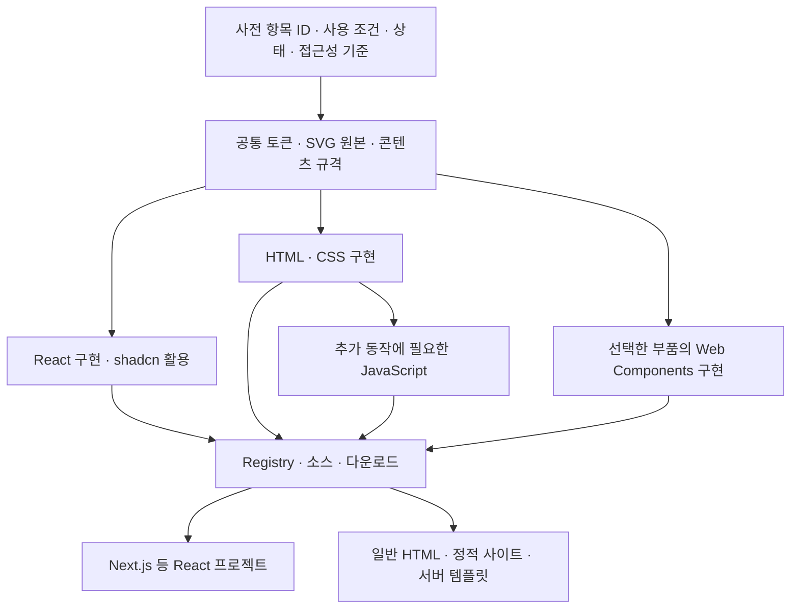

# HTML까지 재사용하는 구현 조사

조사일: 2026-09-22. [디자인 시스템 정의](<디자인 시스템 정의.md>)의 ‘아이콘과 세부 표현까지 개별로 가져오기’와 ‘Next.js·일반 HTML에서 재사용하기’를 기술적으로 어떻게 구현할지 검토한다. 공식 문서에서 확인한 사실과 이 프로젝트에 대한 설계 제안을 구분한다. 코드 예시는 배포 전 설계 예시이며, 레지스트리·라이브러리를 실제로 구현하거나 실행 검증한 결과는 아니다.

## 조사 결론

**구현할 수 있다. 공통 토큰·SVG·부품 명세를 두고, React용 코드와 HTML용 코드를 같은 항목에서 제공하는 방식이 이 프로젝트의 출발점으로 적합하다.** React 쪽은 shadcn을 활용하고, HTML 쪽은 HTML·CSS·필요한 JavaScript를 제공한다. 공통 동작을 여러 환경에서 쓰는 것이 유리한 부품에는 Web Components를 선택적으로 적용한다. 이는 아래 공식 기능에 근거한 설계 제안이다.

배포 도구도 처음부터 새로 만들 필요는 없다. **shadcn의 Registry와 CLI 자체는 React 전용이 아니다.** 직접 만든 HTML·CSS·SVG·JavaScript도 레지스트리 항목으로 배포할 수 있다. 다만 파일을 설치해 주는 것과 그 파일의 동작을 다른 환경으로 바꾸는 것은 다른 일이다. [shadcn Registry](https://ui.shadcn.com/docs/registry), [Universal Items](https://ui.shadcn.com/docs/registry/examples#universal-items)

## shadcn에서 그대로 활용할 수 있는 것

| 구분 | 공식 문서에서 확인한 기능 | 이 프로젝트에 적용할 의미 |
|---|---|---|
| UI 소스 | 프로젝트에 가져와 수정하는 코드와 조합 가능한 컴포넌트를 제공한다 | Next.js·React 구현의 출발점으로 활용한다. 모든 디자인 세부 요소가 이미 독립 항목이라는 뜻은 아니다 |
| Registry | 임의의 프로젝트·프레임워크에 코드와 다른 파일을 배포할 수 있다 | React 부품 외에 SVG 하나, CSS, HTML 조각도 우리 항목으로 등록할 수 있다 |
| Universal Items | 모든 파일의 `target`을 명시하면 프레임워크 탐지나 `components.json` 없이 설치할 수 있다 | HTML 폴더에도 적용 가능한 배포 경로다. 의존 항목도 같은 설치 조건을 충족하게 구성한다 |
| 항목과 파일 | `registry:file`과 파일별 경로·설치 위치를 지정하고, 한 항목에 여러 파일을 묶을 수 있다 | 하나의 부품에 HTML·CSS·동작 파일을 함께 제공하거나 아이콘만 따로 제공한다 |
| 의존성 | `dependencies`와 `registryDependencies`로 패키지 및 다른 레지스트리 항목을 연결한다 | 필요한 공통 토큰·하위 부품을 함께 가져오게 한다 |

근거: [shadcn 소개](https://ui.shadcn.com/docs), [Registry](https://ui.shadcn.com/docs/registry), [Universal Items](https://ui.shadcn.com/docs/registry/examples#universal-items), [항목 스키마](https://ui.shadcn.com/docs/registry/registry-item-json).

사용자가 말한 ‘아토믹하게 쪼개 가져온다’는 방향은 shadcn의 소스 배포·조합 방식과 맞는다. 다만 **아이콘 원본, 부품의 내부 부분, 스타일 세부 표현을 어디까지 공개할지는 우리가 정할 설계**다. shadcn의 기본 목록만 설치하면 이 프로젝트의 전체 목표가 자동으로 완성되는 것은 아니다.

React의 상태·이벤트·컨텍스트를 쓰는 코드는 HTML로 복사해도 그 동작이 옮겨지지 않는다. React의 `renderToStaticMarkup`도 비상호작용 HTML을 출력하고, 그 출력은 React hydration 대상으로 사용할 수 없다고 명시한다. 정적인 카드·문서를 만드는 데는 사용할 수 있지만, 탭·메뉴·폼의 React 동작까지 내보내는 변환기로 볼 수 없다. [React 공식 문서](https://react.dev/reference/react-dom/server/renderToStaticMarkup)

## HTML 지원에서 구분해야 할 조건

HTML도 프런트엔드를 만드는 기반이다. 여기서 구분할 것은 Next.js라는 앱 환경을 쓰는지, 일반 HTML 페이지에 필요한 파일만 연결하는지다.

| 사용 조건 | 전달하는 것 | 사용자가 준비할 것 | 지원의 경계 |
|---|---|---|---|
| React·Next.js | JSX/TSX 소스, CSS, 자산, 패키지 의존성 | 해당 프로젝트와 빌드 환경 | Next.js 전용 기능과 서버·클라이언트 경계를 표시 |
| 빌드 없는 일반 웹페이지 | HTML·이미 빌드한 CSS·SVG, 필요한 경우 브라우저용 JS | 정적 호스팅 또는 로컬 HTTP 서버 | Node.js나 Tailwind 빌드는 사용 단계에서 요구하지 않음 |
| JavaScript 없는 HTML | HTML·CSS·SVG와 기본 HTML 요소 | 브라우저 | 브라우저가 제공하는 동작 외에 커스텀 탭·검색 갱신 등의 기능은 별도 대안 필요 |
| 오프라인 단일 HTML 파일 | CSS·SVG와 필요한 자산을 포함한 HTML | 파일을 열 브라우저 | 외부 CDN·폰트·원격 데이터 의존성을 없애고 파일 열기·인쇄를 따로 확인 |
| Web Components 사용 | 커스텀 태그, 해당 요소를 등록하는 JS, 테마 CSS | JavaScript가 가능한 웹 환경 | 일반적으로 JS 로드·등록이 필요하며, 서버 출력과 무JS 대체는 별도 설계 |

**빌드가 필요 없다는 말은 JavaScript가 필요 없다는 말과 다르다.** Tailwind는 제작 단계에서 정적 CSS로 출력할 수 있으므로 HTML 소비자에게 Tailwind 설치를 요구할 필요가 없다. 직접 CSS를 작성하는 방식도 가능하다. [Tailwind CLI](https://tailwindcss.com/docs/installation/tailwind-cli)

ES modules를 쓰는 배포물은 `file://`로 더블클릭해 여는 조건과 다르다. 브라우저의 모듈 보안 제약 때문에 로컬 HTTP 서버가 필요할 수 있으므로, 단일 파일 제공형은 외부 모듈 불러오기 등을 제거해 별도로 만들어 확인한다. [MDN JavaScript modules](https://developer.mozilla.org/en-US/docs/Web/JavaScript/Guide/Modules#other_differences_between_modules_and_classic_scripts)

이 문서의 HTML 지원 대상은 브라우저의 페이지·문서다. 이메일 HTML과 네이티브 앱은 기존 정의의 별도 매체로 남기며, 웹용 구현의 성공을 그대로 해당 환경의 지원으로 표시하지 않는다.

## 제안하는 구조: 공통 자산과 환경별 구현

다음은 채택을 제안하는 구조다. 실제 폴더명이나 패키지 분할을 확정한 것은 아니다.



| 공유할 원본 | 환경에 맞춰 구현할 것 |
|---|---|
| 항목 ID와 의미, 사용·조합 조건 | React의 props·이벤트와 HTML 속성·DOM 이벤트 연결 |
| 토큰의 이름·값·역할 | 각 환경의 CSS 연결, 스타일 범위, 필요한 테마 매핑 |
| SVG의 도형·이름·사용 기준 | React 컴포넌트, 인라인 SVG, 개별 SVG 파일 형태 |
| 상태·동작·접근성 계약 | 실제 DOM, 상태 관리, 키보드·초점 처리 |
| 예시 콘텐츠와 검사 시나리오 | 환경별 실행 예시·조작 검사·렌더 결과 |

이 구조는 모든 UI 소스를 두 벌로 수작업 복사하자는 뜻이 아니다. 토큰과 자산은 한 원본에서 만들고, 단순 표현은 생성 도구로 출력할 수 있다. 복잡한 상호작용은 환경별 구현을 유지할지 Web Components로 공유할지 부품마다 결정한다. **임의의 shadcn React 코드를 HTML로 완전 자동 변환하는 것을 전제로 두지 않는다.**

### 토큰과 아이콘부터 공통화한다

토큰은 DTCG 형식의 JSON을 원본 후보로 두고 CSS custom properties로 출력하는 방식을 제안한다. 이름·별칭·타입·스타일별 값을 한곳에서 관리하고, React와 HTML이 같은 의미의 변수를 읽게 한다. DTCG는 토큰 교환 형식이며 UI나 CSS를 자동으로 만들어 주는 실행 도구 자체는 아니다. [DTCG Format 2025.10](https://www.designtokens.org/tr/2025.10/format/)

아이콘은 개별 SVG 원본을 기준으로 제공한다. Lucide도 프레임워크 없는 사용을 위해 개별 SVG·sprite·SVG 문자열 등의 정적 자산을 제공하므로, 아이콘을 React 컴포넌트만으로 저장할 이유는 없다. 필요한 아이콘만 복사하거나 선택한 것만 묶어 제공할 수 있다. [Lucide Static Assets](https://lucide.dev/guide/static)

프로젝트의 자산 계약에는 크기·선 굵기·색상 역할, 장식인지 의미 전달용인지, 필요한 접근성 이름을 기록한다. 글자 없이 아이콘으로 행동을 표시하는 경우의 이해 기준은 [디자인 시스템 정의](<디자인 시스템 정의.md>)를 따른다. 자산을 재사용할 때의 출처·버전·이용 조건도 함께 남긴다.

### 세부 표현은 가장 알맞은 형태로 공개한다

다음 분해 방식은 이 프로젝트에 대한 제안이다.

| 작은 단위 | 권장 제공 형태 | 독립 사용 조건 |
|---|---|---|
| 색·간격·선 굵기·전환 시간 | 토큰과 CSS 변수 | 필요한 토큰 묶음을 함께 제공 |
| 화살표·닫기·검색 아이콘 | 개별 SVG, React용 래퍼 | 전체 아이콘 집합을 로드하지 않아도 사용 가능 |
| 구분선·초점 표시·상태 점 | CSS와 최소 HTML 또는 작은 컴포넌트 | CSS 범위와 의미·상태를 설명 |
| 제목·본문·행동 영역 | 카드 등의 공개된 하위 부분 | 부모가 정하는 간격·구조와의 관계를 표시 |
| 필드 라벨·설명·오류 | 개별 부분과 연결 예시 | `for`·`id`·`aria-describedby` 등의 연결을 유지 |
| 대화상자 제목·트리거·내용 | 대화상자 API의 조합 가능한 부분 | 부모 상태·초점·접근성 처리가 필요함을 표시 |

‘개별로 가져오기’는 내부 요소를 부모 없이 아무 데나 붙여도 된다는 뜻이 아니다. 독립적인 SVG와 대화상자 내부 부분은 다른 사용 계약을 가진다. 항목 수를 늘리는 대신 실제 재사용·교체·검증이 가능한 경계를 공개한다.

## HTML 부품을 만드는 방법 비교

| 방법 | 강점 | 추가로 맡을 일 | 이 프로젝트의 제안 |
|---|---|---|---|
| HTML·CSS + 필요한 vanilla JS | 원본이 바로 보이고 편집·문서·인쇄에 적용하기 쉽다 | 복잡한 위젯의 상태·초점·접근성 처리와 React판 일치 관리 | 정적 표현과 단순 동작의 기본 경로 |
| Web Components | 브라우저의 커스텀 요소로 동작을 묶어 여러 HTML 환경에 제공한다 | JS 로드, 스타일 공개 범위, 폼·이벤트·서버 출력 연동 | 공유 이득이 큰 동작형 부품부터 선택 |
| React로 정적 HTML 생성 | 정적 카드·문서의 렌더 코드를 활용할 수 있다 | 브라우저 동작을 별도 구현하고 출력 CSS·자산을 함께 제공 | 정적 출력에 한정한 보조 경로 |
| React와 HTML에 각각 구현 제공 | shadcn과 일반 HTML 양쪽의 사용법에 맞출 수 있다 | 같은 상태·콘텐츠·스타일로 두 구현을 비교하고 함께 갱신 | 공통 토큰·자산·명세를 공유하는 기본 운영 구조 |

기술 근거: [Web Components](https://developer.mozilla.org/en-US/docs/Web/API/Web_components), [Lit](https://lit.dev/docs/), [React 정적 출력](https://react.dev/reference/react-dom/server/renderToStaticMarkup). 표의 적용 판단은 이 프로젝트의 조건을 기준으로 한 제안이다.

HTML의 기본 요소를 우선 검토한다. 접기·펼치기는 `<details>`·`<summary>`의 기본 동작을 사용할 수 있고, 대화상자는 `<dialog>`와 필요한 열기·닫기 제어를 활용할 수 있다. 같은 의미의 기본 요소를 활용하되, 요구하는 브라우저·키보드·초점·중첩 조합을 실제로 확인해야 한다. [MDN details](https://developer.mozilla.org/en-US/docs/Web/HTML/Reference/Elements/details), [MDN dialog](https://developer.mozilla.org/en-US/docs/Web/HTML/Reference/Elements/dialog)

복잡한 위젯을 모두 처음부터 구현하기 전에 기존 Web Components도 대조한다. Web Awesome의 공식 설치 문서는 CDN·직접 호스팅·npm 설치 경로를 제공한다. 이를 HTML용 후보로 검토할 수 있지만, shadcn과의 외형·API 일치나 이 프로젝트의 검증을 보장하는 것은 아니다. 필요한 부품의 스타일 조절·기능·배포 조건을 확인한 뒤 채택한다. [Web Awesome 설치](https://webawesome.com/docs/)

### Web Components를 쓰면 무엇이 달라지는가

Web Components를 사용하면 `<ds-tabs>` 같은 커스텀 태그로 부품을 배치할 수 있다. Lit는 그 부품을 만드는 도구의 한 후보다. Lit 공식 문서는 HTML을 쓰는 환경에서 프레임워크 유무와 관계없이 사용할 수 있다고 설명한다. 태그 이름과 아래 API는 우리 시스템의 설계 예시다. [Lit 소개](https://lit.dev/docs/)

```html
<link rel="stylesheet" href="./design/theme.css">
<script type="module" src="./design/tabs.js"></script>

<ds-tabs aria-label="상품 정보">
  <!-- Documented child markup belongs here. -->
</ds-tabs>
```

이 예시에는 실제 `tabs.js` 구현과 자식 마크업이 아직 없으므로 실행 가능한 완성 예시로 배포하지 않는다. 최종 배포물에는 그 부품이 요구하는 DOM·콘텐츠·사용법까지 포함해야 한다.

Shadow DOM으로 내부 스타일을 격리하면 외부 CSS와 충돌을 줄일 수 있지만, 페이지의 CSS 선택자로 내부를 직접 꾸미는 것도 제한된다. 테마 변수·공개할 `part`·내용을 넣을 `slot` 등을 설계해야 하며, shadcn의 Tailwind 클래스를 그대로 붙이면 내부까지 적용된다고 가정하면 안 된다. [MDN Shadow DOM](https://developer.mozilla.org/en-US/docs/Web/API/Web_components/Using_shadow_DOM), [MDN CSS scoping](https://developer.mozilla.org/en-US/docs/Web/CSS/Guides/Scoping)

React에서도 custom HTML elements를 사용할 수 있지만 속성·프로퍼티·커스텀 이벤트 연결을 확인해야 한다. Next.js에서는 서버에서 출력할 내용과 브라우저에서 실행할 등록 코드를 구분하고, 선택한 구성으로 서버 렌더·초기 표시·이벤트를 시험한다. HTML에서 한 번 작동했다는 이유로 모든 React·Next.js 사용 조건에서 검증됐다고 표시하지 않는다. [React custom HTML elements](https://react.dev/reference/react-dom/components#custom-html-elements)

npm 소비자용 모듈과 HTML 직접 연결용 배포물은 따로 만든다. Lit는 재사용 npm 모듈을 미리 모두 번들링하지 않도록 안내하며, 실제 배포 앱에는 빌드·번들링 방법을 안내한다. 이 프로젝트도 npm용 모듈은 의존성 중복을 줄일 수 있게 제공하고, HTML용은 브라우저가 해결할 수 있는 URL과 필요한 런타임을 포함한 결과물로 준비한다. 모든 부품마다 Lit 전체를 따로 넣는 방식은 피한다. [Lit Publishing](https://lit.dev/docs/tools/publishing/), [Lit Production](https://lit.dev/docs/tools/production/)

## 가져오는 방식: Registry와 직접 복사를 함께 제공

권장하는 사용 흐름은 **항목 검색 → 스타일·환경 확인 → 필요한 파일과 의존성 가져오기 → 해당 환경의 예시로 조합 → 실제 결과 확인**이다.

| 사용자가 원하는 방식 | 제공할 것 |
|---|---|
| shadcn처럼 명령으로 설치 | Registry 항목과 CLI 설치 주소 |
| 설치 도구 없이 가져오기 | HTML·CSS·SVG·JS 원본 복사와 파일 다운로드 |
| 빌드 환경에 통합 | 환경별 소스 또는 npm 모듈과 타입·의존성 |
| 문서 파일로 전달 | 정적 자산을 함께 묶은 폴더 또는 지원 범위를 표시한 단일 HTML |

HTML용 항목도 shadcn Registry에 다음과 같이 정의할 수 있다. 다음은 공식 스키마를 이용한 **원본 `registry.json`의 제안 예시**이며, 파일명·항목명·도메인은 예시다. `target`의 `~/`는 이 스키마에서 사용자 홈이 아닌 설치 대상 프로젝트의 루트를 뜻한다. [Registry 항목의 files·target](https://ui.shadcn.com/docs/registry/registry-item-json#files)

```json
{
  "$schema": "https://ui.shadcn.com/schema/registry.json",
  "name": "design-system",
  "homepage": "https://example.com",
  "items": [
    {
      "name": "divider-html",
      "type": "registry:item",
      "title": "HTML 구분선",
      "files": [
        {
          "path": "registry/html/divider/divider.html",
          "type": "registry:file",
          "target": "~/design/divider/divider.html"
        },
        {
          "path": "registry/html/divider/divider.css",
          "type": "registry:file",
          "target": "~/design/divider/divider.css"
        }
      ]
    }
  ]
}
```

실제 파일을 준비하고 Registry를 빌드·호스팅한 뒤에는 다음 형태로 설치한다. **아래 주소는 예시이며 현재 제공하는 설치 명령은 아니다.**

```sh
npx shadcn@latest add https://example.com/r/divider-html.json
```

이 명령은 파일을 가져오는 단계다. 받은 HTML을 페이지에 넣고 CSS를 연결하는 작업까지 사용 예시에 담아야 한다. CLI를 실행할 때의 Node.js 도구 환경과, 배포된 HTML을 브라우저에서 열 때의 환경도 구분한다. CLI를 쓰지 않는 사람에게는 같은 파일 묶음을 다운로드로 제공한다.

원본과 배포 결과의 매핑은 자동 생성하고, 토큰·자산의 정본을 두 곳에 따로 두지 않는다. Registry 항목 ID와 사전 항목 ID를 연결하고 React판·HTML판의 경로, 필수 의존성, 버전과 검증 상태를 기록한다. 프로젝트용 정보는 항목 명세를 정본으로 두고, 설치·조회에 필요한 값을 Registry의 `meta` 필드에도 연결할 수 있다. [Registry meta](https://ui.shadcn.com/docs/registry/registry-item-json#meta)

소스 복사 방식은 수정 자유도가 높지만 중앙의 수정이 이미 복사한 프로젝트에 자동 반영되지는 않는다. 설치 때 원본 버전과 파일을 기록하고 갱신 시 차이를 보여 주는 운영이 필요하다. 재현 가능한 릴리스에서는 CLI와 의존성 버전도 기록한다. 이는 이 프로젝트의 유지보수 제안이다.

## 구현 순서와 통과 조건

처음부터 전체 사전을 여러 환경으로 구현하는 대신, 같은 부품을 두 환경에서 재사용하는 한 묶음을 먼저 확인한다. 최종 수록 범위를 줄이는 것이 아니라 배포·조합 방식의 실패를 일찍 발견하기 위한 순서다.

| 단계 | 만들 것 | 다음 단계로 넘어갈 근거 |
|---|---|---|
| 공통 원본 | 한 스타일의 토큰, 대표 SVG, 항목 ID와 상태·접근성 명세 | CSS·SVG·React용 자산이 같은 원본과 연결됨 |
| 최소 부품 | 아이콘, 구분선, 버튼, 카드, 라벨·입력·오류 묶음 | 개별 복사·설치가 가능하고 필요한 파일만으로 표시·사용 가능 |
| 두 환경의 조합 | 같은 콘텐츠의 React 페이지와 일반 HTML 페이지 | 색·간격·아이콘·상태 기준이 이어지고 무JS HTML의 내용이 읽힘 |
| 동작형 부품 | 접기·펼치기, 탭, 대화상자 중 대표 조합 | 키보드·초점·여러 인스턴스·좁은 화면에서 동작하고 부모 의존성을 확인 |
| 배포 시험 | Universal Item, 파일 다운로드, 정적 문서 묶음 | 빈 HTML 폴더와 별도 React 프로젝트에서 설치·복사 후 실제 실행 |
| 확장 | 추가 스타일·부품·서버 템플릿·Web Components | 같은 검사 시나리오와 버전 기록을 유지하며 확장 |

처음 비교할 실제 사례는 **아이콘 하나만 가져오기, 카드 제목만 교체하기, 입력·라벨·오류를 다른 폼에 조합하기, 같은 정보 화면을 React와 HTML로 만들기**가 적합하다. 동작형 비교에서는 대화상자 안의 입력과 초점 복귀처럼 단독 표시로는 드러나지 않는 조건을 포함한다.

검증 기록에는 실제 내려받은 파일·JS/CSS 용량·런타임 의존성, 사용한 브라우저와 실행 방식, 화면·조작·접근성 결과를 남긴다. 비교 대상은 제공하기로 한 기능과 디자인 기준이며, 환경이 다른데 DOM 구조까지 같아야 한다고 강제하지 않는다.

## 현재 확인한 범위

공식 문서로 확인한 것은 **범용 파일 배포, 정적 CSS·SVG 제공, HTML의 기본 요소, Web Components와 React 정적 출력의 기능·한계**다. 이 프로젝트의 실제 Registry 설치, React·HTML 간 품질 일치, Web Components의 Next.js 연동, 단일 파일·인쇄 동작은 아직 구현·검증하지 않았다.

이번 조사에 사용한 원문과 확인 범위는 [레퍼런스 출처 대장](<레퍼런스 출처 대장.md>)의 ‘HTML 범용 재사용 구현 조사’에 함께 기록했다. 정의 문서에는 사용자가 원하는 결과를 두고, 이 문서의 기술 제안은 구현 시험 결과에 따라 조정한다.
