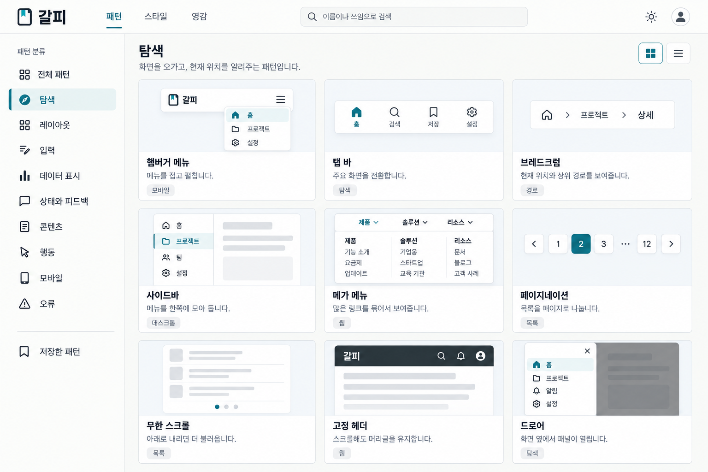
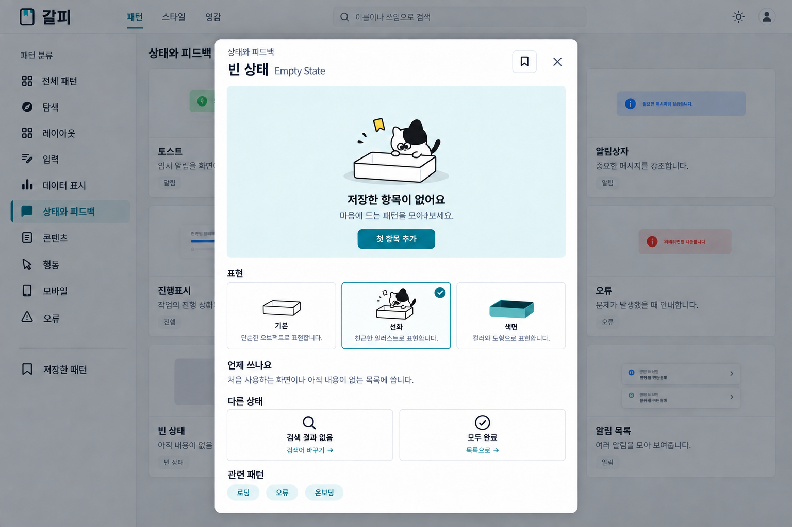
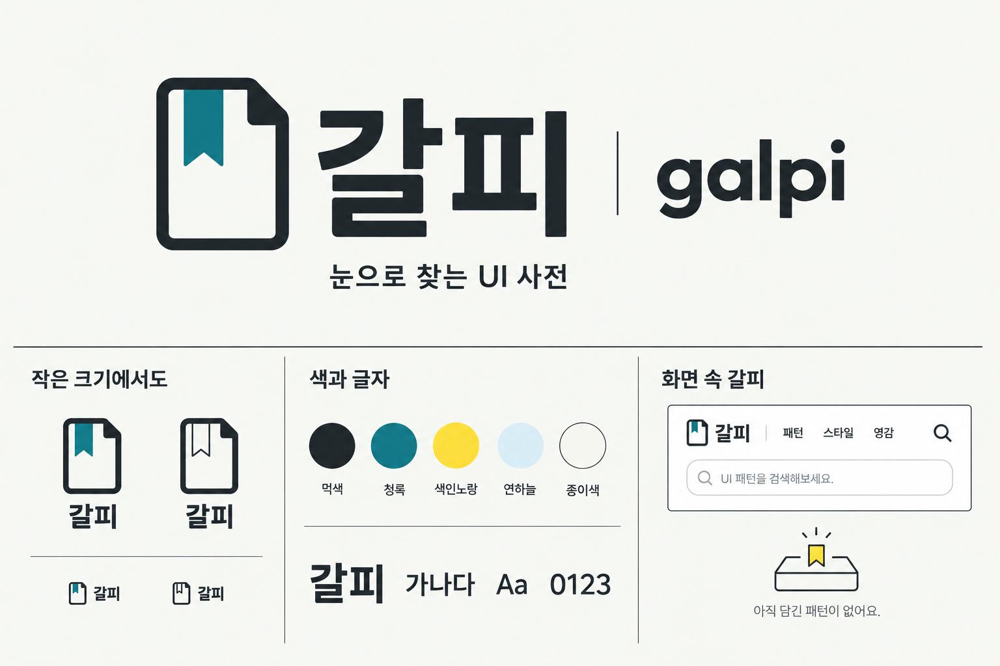
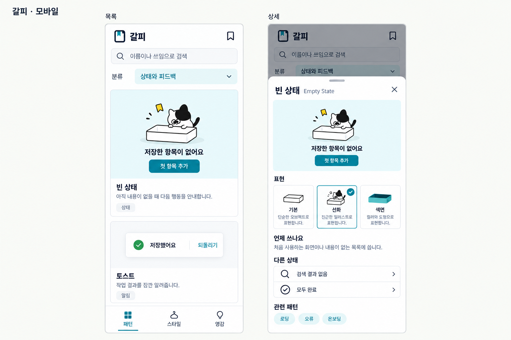

# 갈피 — 이전 미채택 시안

**미채택 기록이다.** 이름의 식별성과 실제 탐색·선택의 편의성을 충분히 검토하지 못했다. 현재 검토안은 [패토브 재설계](../패토브-재설계/README.md)다.

아래는 당시 제작 기록이다. **갈피 / galpi**라는 이름, 접힌 카드와 책갈피 로고, 먹색·청록·종이색을 하나의 시스템으로 만들었다. KAWAI식 검색·분류·미니어처·상세 흐름에 사용자가 추가한 UI 스킬 자료를 반영했다.

| 이미지 | 설계한 내용 |
|---|---|
| [01 브랜드·로고](01-브랜드-로고.png) | 한글·라틴 워드마크, 기호, 단색 변형, 색과 헤더 적용 |
| [02 데스크톱 사전](02-데스크톱-사전.png) | 검색, 좌측 분류, 탐색 패턴 9개의 실제 UI 형태를 보여주는 3열 목록 |
| [03 패턴 상세](03-패턴-상세.png) | 빈 상태 데모, 기본·선화·색면 표현 선택, 사용 시점과 다른 상태 |
| [04 모바일 목록·상세](04-모바일-목록과-상세.png) | 1열 목록, 분류 선택, 하단 탐색, 하단 상세 시트 |

## 근거와 제작

[당시 UI 스킬 분석](UI-스킬-이전-분석.md), [브랜드 설계](브랜드-설계.md), [실제 생성 프롬프트](생성-프롬프트.md)를 함께 보관한다. 이전 [KAWAI 웹 사전 시안](../사전-웹화면/README.md)의 구조를 발전시켰다.

내장 `image_gen`으로 제작했다. 4장 모두 1536×1024 PNG다. 정적 시안이며 실제 앱·벡터 로고·애니메이션 구현물은 아니다. 실제 폰트와 DOM, 키보드·터치·움직임 완화는 구현 단계에서 확인한다.

## 시각 검토 기록

- 로고: 최초 결과의 어두운 배경을 수정해 밝은 종이색과 먹색 글자를 회복했다. 동일한 기호를 데스크톱과 모바일 헤더에 적용했다.
- 목록: 분류 선택을 색과 세로선으로 표현했다. 9개 패턴의 미니어처·이름·쓰임을 함께 읽을 수 있다.
- 상세: 색면 썸네일에 들어간 내용물을 제거해 빈 상태의 뜻을 맞췄다. 관련 패턴 태그도 청록으로 통일했다.
- 모바일: 분류와 검색, 패턴·스타일·영감 탐색을 유지하면서 목록과 상세를 재배치했다.
- 지정한 텍스트 색 조합 5쌍의 대비를 계산했다. 이미지 전체의 접근성 적합성을 선언한 결과는 아니다.

작업 시작 시 읽은 문서·영감 이미지의 전수 목록은 [검토 대상 기록](../검토-대상.json)에 있다. 이번에는 레퍼런스 출처 대장에 분석 연결을 추가했으며, 기존 디자인 시스템 정의의 사용자 수정은 보존했다.
