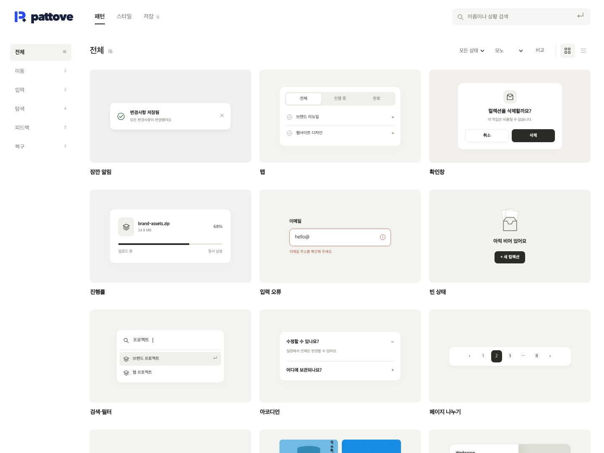
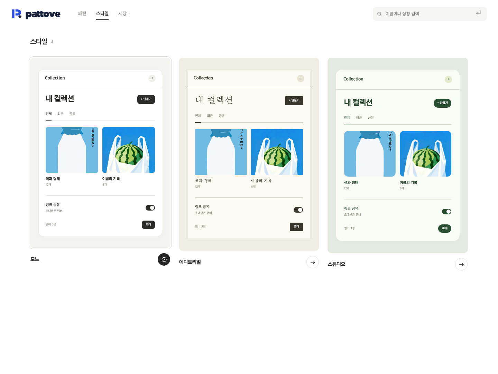

# 패토브

**[실행](index.html) · [이미지](시안보기.html) · [웹 조사와 수정 근거](화면-현행화.md)**

로고와 검색·분류·미리보기·상세 구조를 유지하고, 불필요한 부제·슬로건·사용법 문구와 반복 장식을 제거했다. Cosmos, Layers, Recent 등 7개 실제 웹 화면을 확인하고 목록의 밀도와 위계를 다시 구성했다.

| 화면 | 이미지 |
|---|---|
| 로고 | [보기](01-브랜드-정본.png) |
| 패턴 목록 | [보기](02-패턴-탐색.png) |
| 상황 검색 | [보기](03-상황-검색.png) |
| 비교 | [보기](04-패턴-비교.png) |
| 상세 | [보기](05-상세-체험과-저장.png) |
| 스타일 | [보기](06-화면-전체-스타일.png) |
| 모바일 목록 / 상세 | [목록](07-모바일-탐색.png) / [상세](09-모바일-상세.png) |
| 저장 | [보기](08-저장한-패턴.png) |

HTML·SVG의 실제 렌더다. `index.html`은 설치 없이 브라우저로 열 수 있다. 대표 패턴 16개, 스타일 3개의 시안이며 전체 사전의 구현 완료를 뜻하지 않는다. 검색은 로컬 별칭 색인, 저장은 해당 브라우저의 localStorage다.

[검증 결과](검증-결과.json) · [검증 스크립트](verify.cjs) · [전후 측정](전후-비교.json) · [UI 스킬 적용](<../../../문서/UI 스킬 적용 분석.md>) · [이름과 초기 설계 기록](재설계-근거.md)

이전 브랜드 적용 이미지는 내장 image_gen의 [당시 프롬프트](브랜드-생성-프롬프트.md)와 함께 이력으로 보관하며 현재 화면 이미지 모음에서는 제외했다. 로고 정본은 변경하지 않은 [SVG](assets/mark.svg)다.
